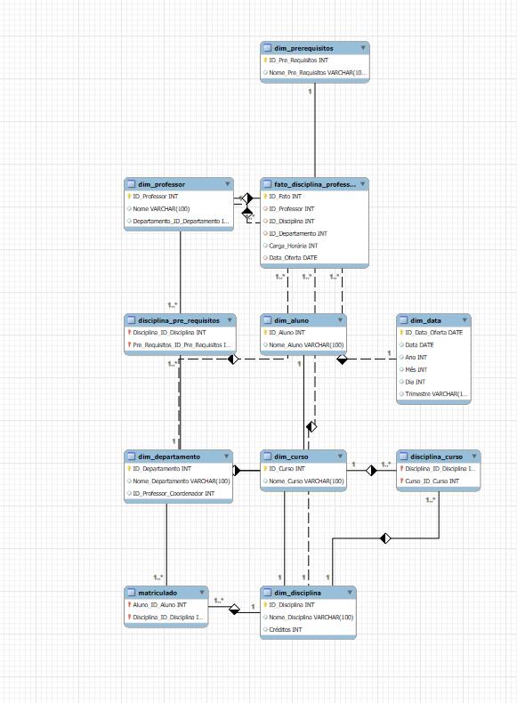

# Projeto de Modelagem Dimensional em Star Schema

## Descrição

Este repositório contém um projeto de modelagem dimensional para um banco de dados acadêmico. O objetivo é criar um modelo em estrela (star schema) para análise de dados de professores, disciplinas, departamentos e cursos. O modelo foi desenvolvido usando MySQL Workbench e inclui a criação de tabelas fato e tabelas dimensão, além de relacionamentos entre essas tabelas.

## Objetivo

O objetivo deste projeto é fornecer uma estrutura de banco de dados eficiente para a análise de dados acadêmicos. O esquema em estrela é ideal para consultas analíticas e relatórios, facilitando a análise de desempenho dos professores, disciplinas e cursos.

## Instruções de Uso

### 1. Configurar o Banco de Dados

1. Abra o MySQL Workbench e conecte-se ao seu servidor MySQL.
2. Abra uma nova aba de consulta e cole o conteúdo do arquivo `escola.sql`.
3. Execute o script SQL para criar as tabelas e relacionamentos no banco de dados.

### 2. Visualizar o Diagrama

1. No MySQL Workbench, vá para o menu **File** > **Open Model** e selecione o arquivo `diagram.png` para visualizar o diagrama.
2. Para ver o diagrama interativo, use o recurso de **Reverse Engineering** no MySQL Workbench para gerar o diagrama a partir do banco de dados criado.

## Diagrama Entidade-Relacionamento (DER)

## Tabelas e Relacionamentos

### Tabelas Dimensão

- **Dim_Professor**: Armazena informações sobre os professores.
- **Dim_Departamento**: Armazena informações sobre os departamentos.
- **Dim_Disciplina**: Armazena informações sobre as disciplinas.
- **Dim_Curso**: Armazena informações sobre os cursos.
- **Dim_PreRequisitos**: Armazena informações sobre os pré-requisitos das disciplinas.
- **Dim_Aluno**: Armazena informações sobre os alunos.
- **Dim_Data**: Armazena informações sobre datas para análise temporal.

### Tabela Fato

- **Fato_Disciplina_Professor**: Contém dados de desempenho dos professores nas disciplinas, incluindo carga horária e datas de oferta.

### Tabelas de Relacionamento

- **Disciplina_Curso**: Relaciona disciplinas com cursos.
- **Disciplina_Pre_Requisitos**: Relaciona disciplinas com seus pré-requisitos.
- **Matriculado**: Relaciona alunos com disciplinas nas quais estão matriculados.

## Contribuição

Se você deseja contribuir para este projeto, por favor siga as etapas abaixo:

1. Fork este repositório.
2. Crie uma branch para suas alterações (`git checkout -b minha-nova-feature`).
3. Faça commit das suas alterações (`git commit -am 'Adiciona nova feature'`).
4. Envie para a branch do seu fork (`git push origin minha-nova-feature`).
5. Crie uma Pull Request.

